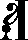
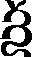
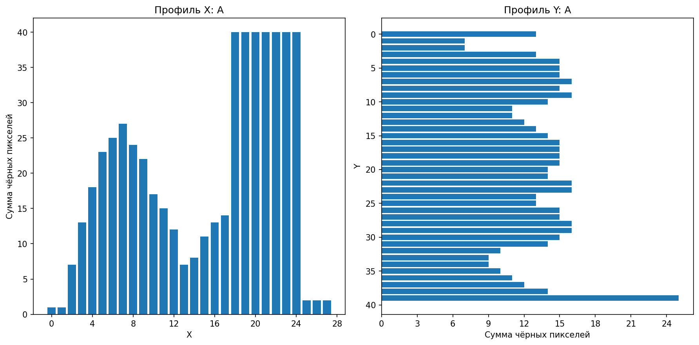
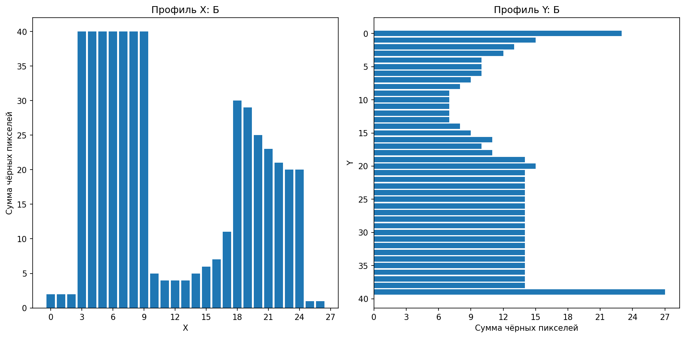
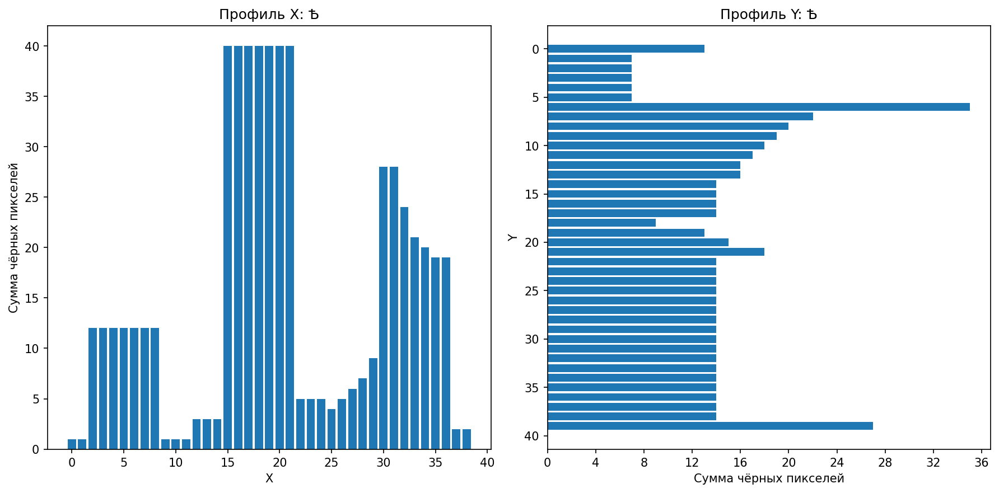
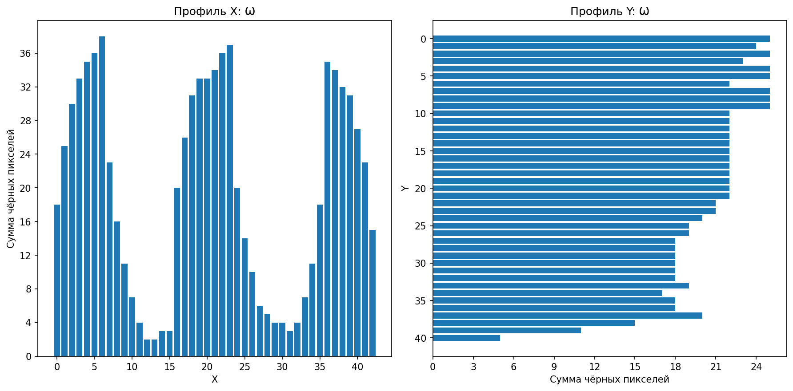
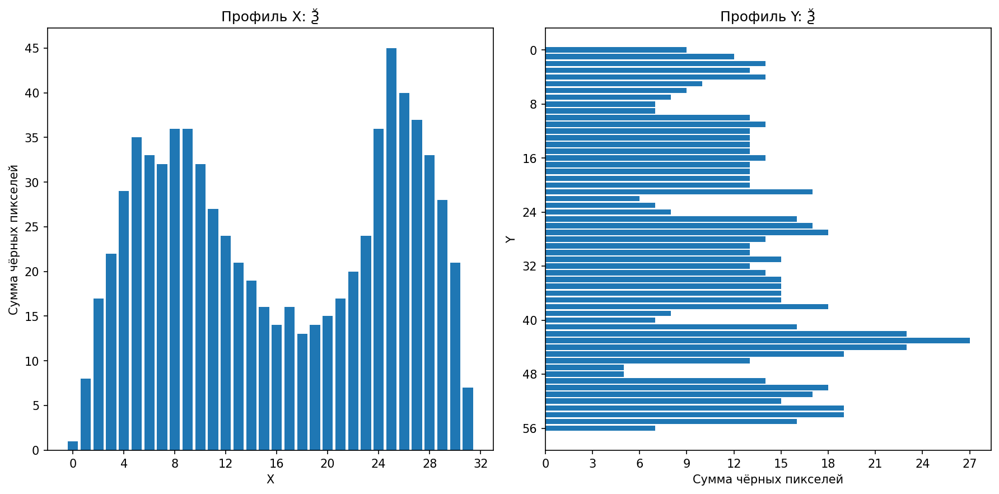
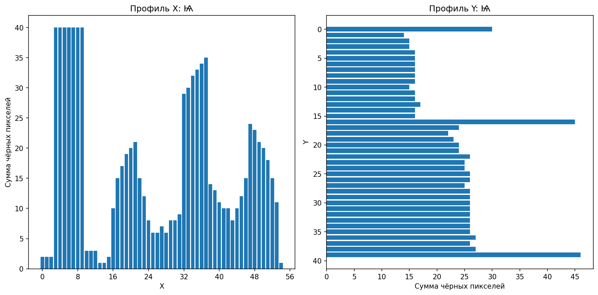

# Лабораторная работа №5
## Выделение признаков символов

### Описание

Проект на **Python**, реализующий генерацию эталонных изображений символов и вычисление их признаков.

В работе используется алфавит **«Кириллица заглавные»** и шрифт **Ponomar Unicode**.  
Для каждого символа выполняются следующие шаги:

1. генерация эталонного изображения символа;
2. бинаризация изображения;
3. обрезка белых полей;
4. вычисление скалярных признаков;
5. построение профилей `X` и `Y`;
6. сохранение результатов в файлы.

Каждый символ сохраняется по принципу:

- **1 символ = 1 файл**

---

# Используемый алфавит

В работе используется следующий набор символов:

```text
А Б В Г Д Є Ж Ѕ З И І К Л М Н О П Р С Т Ѹ Ф Х Ц Ч Ш Щ Ъ Ы Ь Ѣ Ю Ѵ Ѯ Ѱ Ѡ Ѧ Ѩ
```

Этот набор символов сохраняется в файл:
```text
lab5_output/alphabet.txt
```

---

# Используемый шрифт

Для генерации изображений используется шрифт Ponomar Unicode.

---

# Основные настройки

В коде используются следующие настройки:

```text
FONT_SIZE = 52
BINARIZE_THRESHOLD = 200
CROP_PADDING = 0
CANVAS_SIZE = (240, 240)
```

### FONT_SIZE

Кегль шрифта. В данной работе используется размер 52.

### BINARIZE_THRESHOLD

Порог бинаризации изображения после рендеринга символа.

### CROP_PADDING

Дополнительный отступ после обрезки белых полей.

### CANVAS_SIZE

Размер рабочего холста, на котором рисуется символ перед обрезкой.

---
# Эталонные изображения символов

Символы рендерятся в градациях серого, затем бинаризуются и обрезаются по границам чёрных пикселей.
После этого каждый символ сохраняется в отдельный файл в папку:
```text
lab5_output/symbols/
```
Файл сохраняется с безопасным именем в формате:
```text
U+КОД_СИМВОЛ.png
```

---
# Примеры эталонных изображений

| Символ А | Символ Б | Символ Ѣ |
|---|---|---|
|  |  |  |

| Символ W | Символ Ѯ | Символ Ѩ |
|---|---|---|
|  |  |  |

---
# Вычисляемые признаки

Для каждого символа рассчитываются следующие признаки.

## Вес по четвертям изображения

Изображение делится на 4 части:

- верхняя левая;
- верхняя правая;
- нижняя левая;
- нижняя правая.

Для каждой четверти вычисляется количество чёрных пикселей:

- q1_weight
- q2_weight
- q3_weight
- q4_weight

## Удельный вес по четвертям

Вес каждой четверти нормируется на площадь соответствующей четверти:

- q1_relative_weight
- q2_relative_weight
- q3_relative_weight
- q4_relative_weight

## Координаты центра тяжести

Вычисляются координаты центра тяжести чёрных пикселей:

- center_x
- center_y

## Нормированные координаты центра тяжести

Координаты центра тяжести нормируются по размеру изображения:

- center_x_norm
- center_y_norm

## Осевые моменты инерции

Вычисляются осевые моменты инерции:

- Ix — относительно горизонтальной оси;
- Iy — относительно вертикальной оси.

## Нормированные осевые моменты инерции

Моменты инерции нормируются по размеру изображения:

- Ix_norm
- Iy_norm

## Профили X и Y

Вычисляются профили символа:

- X — сумма чёрных пикселей по столбцам;
- Y — сумма чёрных пикселей по строкам.

---
# Профили символов

Профили сохраняются в виде PNG-файлов в папку:
```text
lab5_output/profiles/
```
В одном PNG-файле сохраняются:

- профиль X
- профиль Y

Профили строятся в виде столбчатых диаграмм с целочисленными подписями на осях.

---
# Примеры профилей

| Символ А | Символ Б | Символ Ѣ |
|---|---|---|
|  |  |  |

| Символ W | Символ Ѯ | Символ Ѩ |
|---|---|---|
|  |  |  |

---
# Таблица признаков
Все скалярные признаки сохраняются в CSV-файл:
```text
lab5_output/features.csv
```
---
# Установка

Установка зависимостей:

```bash
pip install pillow numpy matplotlib
```

---
# Запуск программы

Запуск программы:

```bash
python laba5.py
```

---
# Примечание
Для программы нужно указать путь к шрифту вручную в переменной:
```text
FONT_PATH
```